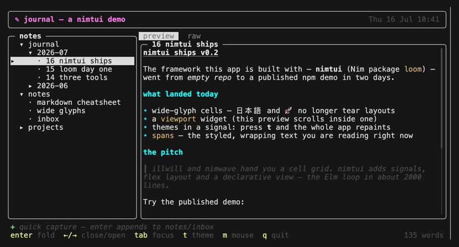
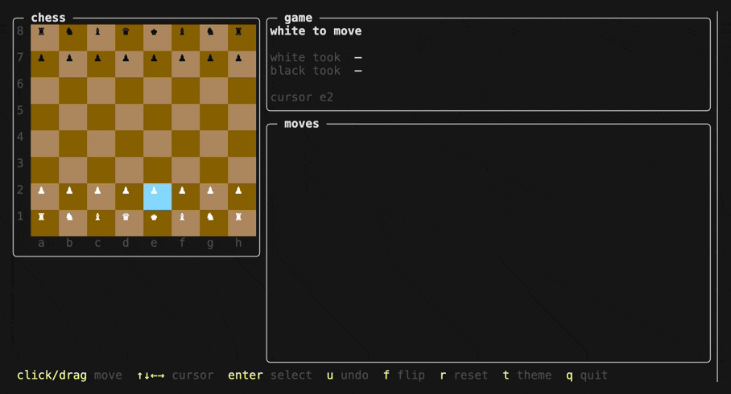

# loom

A reactive terminal UI framework for Nim. Declarative widget trees via a
macro DSL, fine-grained reactivity via signals, a flex layout engine, and
diffed ANSI rendering — compiled to a single zero-dependency binary.

```nim
import loom

let cpu = signal(0.42)

proc view(): Widget =
  tui:
    vbox:
      panel(title = "stats", height = fixed(3)):
        gauge(cpu.get, label = "cpu")
      panel(title = "items"):
        for name in ["alpha", "beta", "gamma"]:
          text(name)

let app = newApp(view)
app.onKey(proc (k: Key): bool =
  if k.isChar("q"): app.quit(); true else: false)
app.run()
```

Set `cpu` from anywhere — a timer, a socket, a subprocess — and the UI
updates itself. No manual redraw calls, no dirty flags, no virtual DOM.

## Why

Nim has excellent low-level terminal libraries (illwill and friends) but no
high-level framework: nothing with reactive state, a layout system, and a
declarative API. loom fills that hole, and Nim's macro system is what makes
the DSL feel native — `tui:` blocks are plain Nim, so `if`, `case`, `for`,
and `let` work anywhere inside the tree.

## How it works

```
Signal ──changes──▶ App marks dirty ──▶ view() rebuilds widget tree
                                              │
   terminal ◀── minimal ANSI diff ◀── render into cell Buffer
```

- **`reactive.nim`** — `Signal[T]` with automatic dependency tracking.
  Reading a signal inside the render pass subscribes it; writing one marks
  the app dirty. Dependencies re-track on every run, so conditional reads
  (`if cond.get: a.get else: b.get`) subscribe exactly what they use.
- **`theme.nim`** — named style sets (default / neon / mono built in)
  that widgets fall back to when no explicit style is given. The active
  theme is itself a signal: `setTheme(themeNeon)` restyles the whole app
  in one repaint.
- **`widget.nim`** — the flex layout engine. Each widget has a `SizeSpec`
  per axis: `fixed(n)` cells, `flex(weight)` share of the remainder, or
  `fit()` measured from content.
- **`buffer.nim`** — a cell grid double buffer with compact cells (one
  `Rune` + style, no per-cell heap allocation). Wide glyphs (CJK, emoji)
  take two columns and are handled through measurement, clipping, cursor
  math, and diffing. Consecutive frames are diffed and only changed cells
  are written, with minimal cursor moves and SGR changes.
- **`term.nim`** — raw mode, alternate screen, SIGWINCH resize handling,
  and an escape-sequence parser for keys (arrows with ctrl/shift/alt
  modifiers, function keys, chords, UTF-8), SGR mouse events (click,
  drag, wheel), and bracketed paste. The terminal is always restored: normal
  quit, exceptions, SIGTERM/SIGHUP, and unexpected exits (exit proc);
  ctrl-z suspends and resumes cleanly. POSIX only; no ncurses, no
  external packages. `feedInput` injects bytes for tests and programmatic
  driving.
- **`dsl.nim`** — the `tui` macro. It only rewrites nesting into
  constructor-plus-`add` calls, so everything inside is ordinary Nim.
- **`app.nim`** — the event loop: poll input with timer-aware timeouts,
  dispatch keys (focused widget → global handler → defaults), paste, and
  mouse events (hit-tested against last frame's layout: click focuses and
  acts — select a list row, switch a tab, place the input cursor; wheel
  scrolls), run timers, rebuild when dirty. Tab / shift-tab cycle focus;
  `autofocus = true` starts a widget focused, and an `id` keeps focus on
  the same widget when rebuilds change the tree shape. Mouse capture is
  **opt-in** (`newApp(view, mouse = true)`, toggleable with `setMouse`)
  because capturing clicks disables the terminal's own text selection.
  `app.execAsync(cmd, args, done)` runs subprocesses off the loop — the
  callback fires on the UI thread when the process exits, so a slow `ps`
  never freezes input. `renderFrame`/`processEvent` expose the loop for
  headless tests.

State lives in signals you own; the view is a pure function of them,
rebuilt per dirty frame and diffed at the cell level (an Elm-style loop
without the boilerplate).

## Widgets

| widget | description |
|---|---|
| `vbox` / `hbox` / `panel` | flex containers; `panel` adds border + title |
| `text` | multiline, alignment, word wrap |
| `gauge` | smooth eighth-block bar, auto green/yellow/red |
| `sparkline` | multi-row block-tick chart, auto-scaled |
| `list` | selectable + scrollable; keyed selection (`selectedKey` + `keys`) survives re-sorted data; tails output when non-interactive |
| `spans` | mixed-style rich text; `wrap = true` flows fragments across lines |
| `viewport` | scrollable window over tall content, with scrollbar |
| `table` | auto-sized columns |
| `input` | single-line editor with cursor, rune-aware |
| `tabs` | arrow-key switchable tab bar |
| `spacer` / `rule` | flexible gap / horizontal divider |

All constructors are plain procs — the DSL is optional sugar.

## Examples

**Dashboard** — a live system dashboard (`ps` process table with
reactive filtering, load gauge + history sparkline, memory, log panel,
tabs, themes). Try it without installing Nim:

```sh
npx nimtui         # prebuilt binary via npm (macOS arm64)
```

**Journal** — a notes app stressing the layout system: a file-tree
sidebar (keyed selection that survives folding) beside a markdown-ish
preview rendered as styled `spans` inside a scrollable `viewport`, a
raw-source tab, and a quick-capture input.



**Chess** — a hot-seat chess game whose board is one custom widget
(`render` + `handleKey` + `handleMouse` methods) riding the framework's
focus, hit-testing and dirty-repaint machinery. Full legal moves
(castling, en passant, promotion, mate/stalemate detection), click-click
or drag-and-drop with hover highlights, keyboard cursor, undo, board
flip. Every move below is played with the mouse:



Build them from this repo:

```sh
nimble demo        # dashboard -> ./bin/dashboard
nimble journal     # journal   -> ./bin/journal
nimble chess       # chess     -> ./bin/chess
```

The release binaries are ~300 KB and link only libSystem/libc.

## Testing

Everything is unit-testable without a terminal: `renderToString` for
plain snapshots, `attrMap(buffer, attr)` for style assertions, `feedInput`
+ `pollEvent` for the escape-sequence parser, and `renderFrame` +
`processEvent` for the full app loop (focus, dispatch, hit-testing):

```sh
nimble test
```

## Status / roadmap

v0.2 — functional, themed, width-aware, and tested (100+ headless tests).
Deliberately out of scope for now:

- Windows (VT sequences would work; the input/termios layer is POSIX)
- grapheme clusters (ZWJ emoji sequences, combining marks render as
  their component runes)
- hover/motion mouse events without a button held (drag is supported)
- interactive widgets *inside* a viewport (viewport content is
  display-only)

## License

MIT
